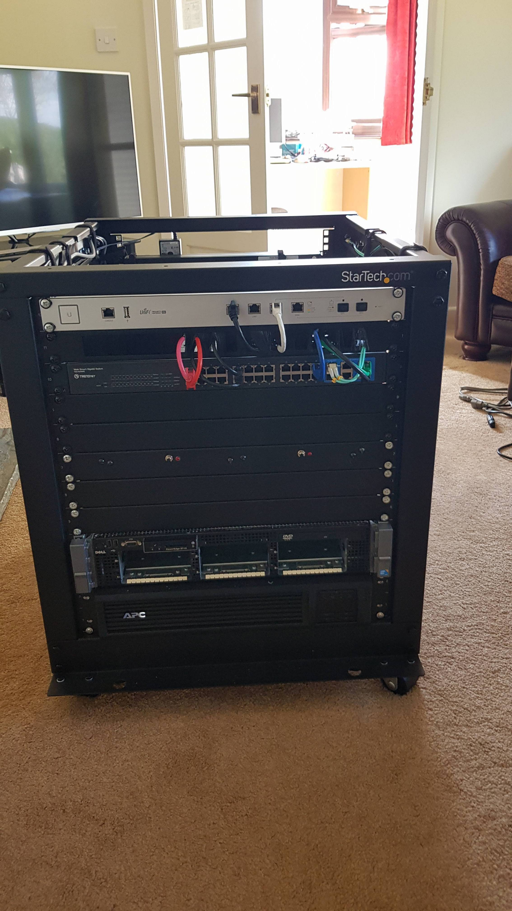

# My Homelab - Part 1

## Getting started
As I said in my first post the start of my homelab really started thanks to a push from a friend at college and also the changes to the home network that needed to be made. 

The first step of my lab was adding two UAP-AC-LR and a Cloud Key from Unifi. This addition is not really 'homelab' per say but it was one of the key factors that got me started. It also gave me a starter into the journey of doing this.
This simple network looked something like this:

Whilst just a simple setup, no VLANs or anything else such as that, this was a big step forward. For starters it meant that the WiFi in the house was significantly better, and improving the families user experience is always a good thing. 
Secondly, it gave me a step to start learning the Unifi eco-system, at the time I didn't realise how much of an impact this would have on me going forward. 

The switch, well, pretty rough, a 48 port switch but most of them are only 10/100 and there is no POE so had to use the injectors for the APs.

The APs where solid, and they still are, four years later and these two are still in the household infrastructure. Whilst they are a bit of a pain due to them being 24v Passive POE, they are great APs. 

The Cloud Key is a good piece of hardware that gave me an easy way to run the controller whilst I had little knowledge at the time. These gen 1 keys have their issues, for example possible corruption due to a power failure. 
Looking back, I think that if I was to have had more knowledge I would have considered using a virtual machine or a Raspberry Pi. That being said I have setup the controller using a Raspberry Pi for a friend and it was not a fantastic experience when it came to updates. 

## Adding a server 
The next step in this whole journey was to add my first server. This was really from a kick from a friend at college. We spent a few lectures looking at them on eBay and then within two weeks or so of him joining the college the server was on order. 

The server that I ended up with was a Dell R710, which is still part of the homelab today. 
The specifications of the machine when I bought it was:

* 2x X5660 2.8GHz
* 96GB RAM
* Perc6i Raid Card

The first drives that I installed where:
* 4x 500GB
* 2x 1TB
Right now, I can't remember what raid setup these drives where in, I think it was three raid1 arrays, with pairs of each size.

## Other additions 
Having added a server, this meant adding a few more things. Firstly a rack, we ended up with a StarTech 12U expandable depth rack. This appears to be a fairly popular rack on r/homelab, and personally I can see why. The fact that it is expandable made it perfect for me and my lack of rack experience. It was also delivered on Amazon Prime flat packed and was easy to put together so a major plus there. 

Next a UPS was added, here I opted for a 750va APC Smart UPS. A fairly basic UPS in terms of functionality, mainly for the fact that it has no networking. It does have a USB and serial connectivity for connecting to a server and triggering a shutdown in the event of power loss. 

The next biggest upgrade for me was adding a router, that wasn't provided by an ISP. To keep with the Unifi ecosystem I went for a USG-Pro-4. At the time this was a perfect router, and I am sure that it is still pretty perfect for most people. 
With the extra addition of a Switch 8-150w shortly after I was able to start really learning more networking concepts for example the use of VLANs. 
The addition of these devices was perfect for my continual learning and also it meant I could improve the setup for the house even further. 

## Where are we now?
At this point I have the first real setup that I am calling my homelab. It was certainly not the tidiest and compared to some of those online, it was tiny. That being said, it was perfect for me. From the point in the following image I learnt a lot, to start with my networking experience greatly improved, which it just so happened was a great asset for me at work shortly after with some server room changes and issues. I also had started to dip my toes into the world of virtualisation, using Server 2016 with Hyper-V I had several virtual machines running. Some of these where used to run things for the house, such as Pi-Hole, others had absolutely no use for any other than myself like Active Directory. 

## What next?
Next the lab grew some more, moved and even more was learnt but I will detail all of that in the next post.