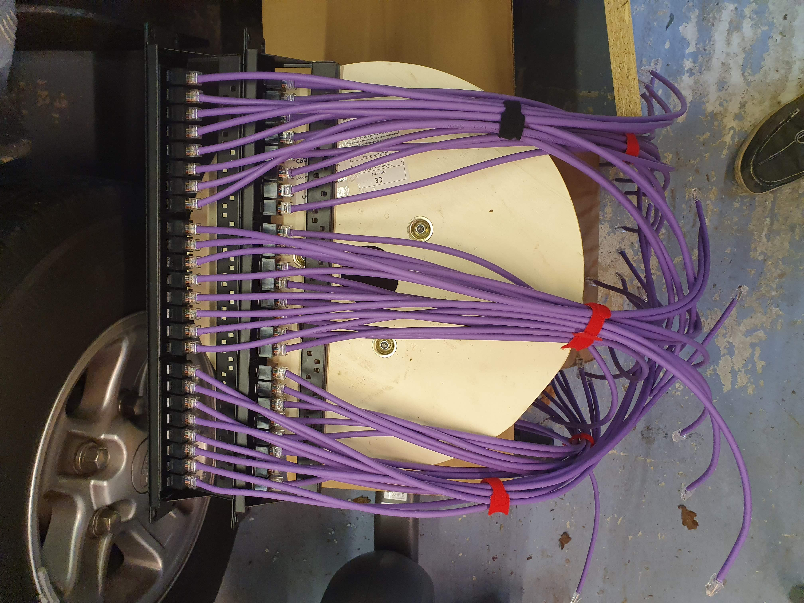

# The Garage Lab
Finally we get to why this blog got it's name.

In the first post about the lab I commented that the lab would move, and move it did, to the garage.

## Why?
Why would I move a perfectly functional homelab? The main reasons are heat and noise. The rack as it was in part two was based in my office, and this was okay.

I say was okay, as the lab has grown it was no longer a viable option. To start with, the noise. One server alone was quite loud, but having added more, well it got a bit much. The servers, and switches could be heard throughout the house, especially if the door was open. It was even worse if there was a power outage at night and all of the machines start back up, cause that is not a quiet process. 

Next, the heat. It got hot! Especially in the summer it was becoming unbearable to be in the office. I would be putting on shorts just to be working from home but then changing as soon as I left the room. 

The lab was also growing, more servers, more switches and more uses around the house. So a bigger rack was also needed, and anything bigger within the office would not be practical. If only one reason was needed, it's on the first floor, and the last thing I wanted was a rack falling through the ceiling. 

## The Solution
The solution to the problem... move the rack to the garage. This would have several benefits, firstly size. I would be able to get a bigger rack and get more equipment to keep growing and learning. 
Next noise was not as much of an issue, I don't want it to be too audible from outside the garage but it won't be disturbing me whilst working or gaming. And the same goes for the heat, don't want too be generating too much heat as to affect the use of the garage, but it won't be impacting anyone too much. 

### Cabling
To be able to follow through with this whole idea I needed to get cabling into the garage. We decided to run cat6a, and six of them. This number allows for possible failover, but also the finally configuration included having 4 in a LAG configuration.
Running the cable was a long process so of course, some pictures where needed...

Not too many because it was busy doing the work, but they where installed with no problems, and once some issues with the right connectors where sorted they all worked straight away.

### Rack
Originally I was looking for about a 32U rack, watching eBay and Facebook Marketplace. Whilst looking at marketplace we saw a 42U HP rack for £100. The next week and a day off, Dad and I have hired a van and are off to pick it up. 

A lot of work went into racking all of the equipment, and time spent cleaning all of the dust from them having been in a carpeted room inside. 

### Networking
Once everything was in, it was messy, and the networking was the worst.

The first step was to tidy the patch panels at the top. I ended up with two in the front and rear, front a and b, and rear a and b. This made it a lot easier to know where I was connecting things in the rear of the rack and where to patch them in front.

### Power
The rack itself came with a couple of HP PDUs which I used for a while, as well as a 19" PDU that I had from the previous setup. Just one 750va UPS was in the rack and this was being used just for the main server to ensure safe powerdown.

### Servers
